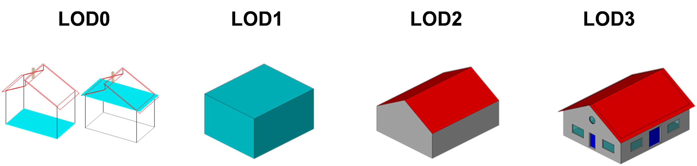
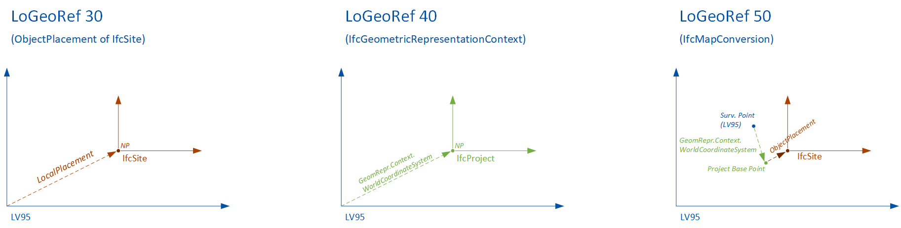

# 3D-GIS-BIM

<!-- TOC -->

* [3D-GIS-BIM](#3d-gis-bim)
    * [Project description](#project-description)
    * [Getting started](#getting-started)
    * [Getting started (Development)](#getting-started-development)
    * [Configuration](#configuration)
        * [Configuration Sections](#configuration-sections)
            * [LOD](#lod)
            * [IFC Product Configuration](#ifc-product-configuration)
            * [Volumetric Modeling](#volumetric-modeling)
            * [Coordinate Reference Systems](#coordinate-reference-systems)
        * [Spatial Structure](#spatial-structure)
        * [Property and attribute mapping](#property-and-attribute-mapping)
        * [Technical documentation](#technical-documentation)
    * [Geometry conversion](#geometry-conversion)
    * [Georeferencing](#georeferencing)
* [References](#references)

<!-- TOC -->

## Project description

This prototype was developed as part of a project commissioned by the Canton of Basel-Landschaft to the Fachhochschule
Nordwestschweiz. The tool allows the visualization of IFC data in a 3D GIS format by converting IFC files into CityGML.
Its functionality includes the conversion of spatial structures for buildings and bridges, as well as the conversion of
spatially unstructured elements.

## Getting started

Build the docker image:

```console
docker build -t ifc2gml .
```

Run the docker container:

```console
docker run --rm -v .:/data -w /data ifc2gml input.ifc output.gml
```

The tool is executed by running main.py. It expects the following parameters:

1. Path to the input IFC file
2. Path to the output GML file

The tool uses a [default configuration](config.yml). To use your own, you can map a specific file from your host machine
to the docker container.

```console
docker run --rm -v .:/data -v ./my_local_config.yml:/workspace/config.yml -w /data ifc2gml input.ifc output.gml
```

## Getting started (Development)

Build and run docker container or build and open a container with your IDE (e.g., VSCode, PyCharm)

```console
docker-compose -f docker-compose-dev.yml up 
```

Install pip packages (Run in container at /workspace)

```console
pip install --no-cache-dir --upgrade -r /workspace/requirements.txt
```

## Configuration

The conversion process is managed through a configuration file that defines the **Level of detail** and which **IFC
entities**, **Attributes** and **PropertySets** are included in the conversion.

### LOD

The configuration begins with the definition of the Level of Detail (LOD). The selected LOD determines the LOD class to
which all geometrical elements are written and must be manually adapted to fit the to-be-processed IFC file and
configuration. The CityGML Conceptual Model differentiates four consecutive Levels of Detail (LOD 0-3), where objects
become more detailed with increasing LOD with respect to their geometry.



### IFC Product Configuration

The rest of the configuration is divided into four sections, which are processed sequentially. This defined order
guarantees predictable and consistent conversion behavior. Once an IFC product has been handled by a configuration, it
will not be considered again by any later configurations.

1. **Building Configuration:** Targets all `IfcProduct` entities associated with an `IfcBuilding`.
2. **Bridge Configuration:** Targets all `IfcProduct` entities associated with an `IfcBridge`.
3. **Other Construction Configuration:** Targets all other `IfcProduct` entities that were not processed by the previous
   two sections.
4. **Generic Configuration:** Targets all other `IfcProduct` entities that were not processed by the previous three
   sections.

### Property and attribute mapping

For each entity defined in the configuration, you can specify which **Properties** and **Attributes** should be
transferred. The properties are automatically mapped to **Generic Attribute Sets**. The attributes are mapped to
**Generic Attributes**. Properties and attributes that cannot be found are ignored.

Use this notation to configure the properties: pset_name.property_name

The **Name** and **Description** attributes are automatically considered and must not be specified explicitly.

### Technical documentation

The technical documentation for the configuration can be found [here](configuration_schema.md). To generate the
document, do the following:

Generate json schema:

```
with open("configuration.json", "w") as stream:
    import json
    json.dump(Configuration.model_json_schema(), stream, indent=4)
```

Generate markdown with [jsonschema-markdown](https://pypi.org/project/jsonschema-markdown/):

```
jsonschema-markdown configuration.json > configuration_schema.md --no-empty-columns
```

## Volumetric Modeling

The resulting CityGML model does not use surface-based entities. Instead, geometries are written as volumetric
construction elements, installations, rooms, and furniture. This modeling approach is enabled by CityGML 3.0, which
introduces dedicated volumetric entities beyond the surface representations.

## Coordinate Reference Systems

If the IFC file contains an `IfcCoordinateReferenceSystem`, the corresponding EPSG code is automatically transferred to
the CityGML file. Therefore, the EPSG code does not need to be configured manually.

## Spatial Structure

The converter automatically recognizes spatial structures defined within the IFC file:

* **Buildings:** `IfcBuildingStorey` structures are identified.
* **Bridges:** `IfcBridgePart` structures are identified.

During the conversion, nested spatial hierarchies are flattened into a single level to ensure compatibility with
CityGML, which, in contrast to IFC, does not support nested hierarchical spatial structures.

## Geometry conversion

During the process, all IFC geometries are converted into B-Rep representations using IfcOpenShell’s geometry library.
This conversion step is required because CityGML supports only boundary representation (B-Rep) geometries.

## Georeferencing

CityGML requires the use of global coordinates. To convert the IFC model correctly, the georeferencing information must
be accurately processed. Supported are the so-called "Level of Georeferencing" (LoGeoRef), according to
(Clemen&Görne, 2019) [^LoGeoRef]. The different levels represent different methods of defining informations about
georeferencing in IFC.

- **LO_GEO_REF_30**
    - `IfcObjectPlacement` of an `IfcSpatialStructureElement` contains georeferencing
- **LO_GEO_REF_40**
    - `IfcGeometricRepresentation` context of `IfcProject` contains georeferencing
- **LO_GEO_REF_50**
    - `IfcMapConversion` defines georeferencing of the "SurveyPoint", including coordinate system parameters

For every supported georeferencing the tool applies a transformation matrix to all geometries in the model, converting
them from local values into global values.



# References

[^LoGeoRef]: "Clemen, C., Görne, H., 2019. Level of Georeferencing (LoGeoRef) using IFC for BIM. Journal of Geodesy,
Cartography and Cadastre, 10/2019, S. 15-20. ISSN: 1454-1408" .  
